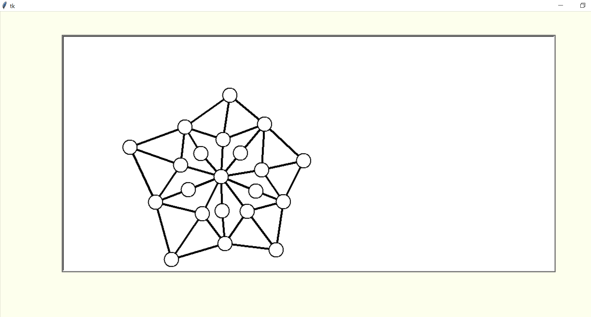

## **Tkinter visualization of graphs**
This is my project of visualization of 
[graphs](https://en.wikipedia.org/wiki/Graph_\(discrete_mathematics\)). I plan to add visualization of graph algorithms in the future.

At the moment, it can visualize graph created as Graph object.\
You can also modify graph by adding vertices or edges on canvas.

How to use the program:
    - Start the program by running app.py
    - You can modify graph from code
    - Or you can change the graph on canvas:
        - Add vertex by left click
        - Add edge by dragging between vertices with left button
        - Move vertices with right mouse button
    
    \
(You can find bare Graph class in branch graph_class)
  
